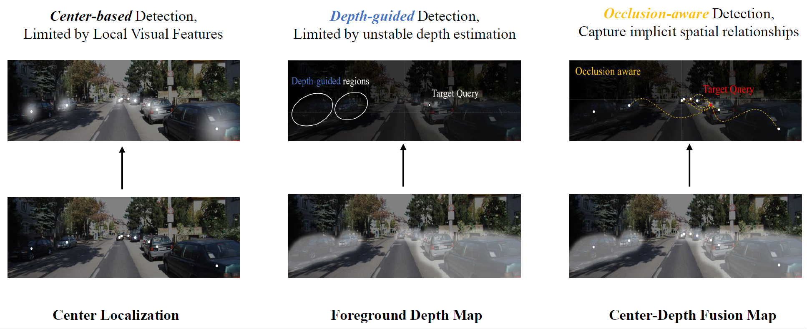
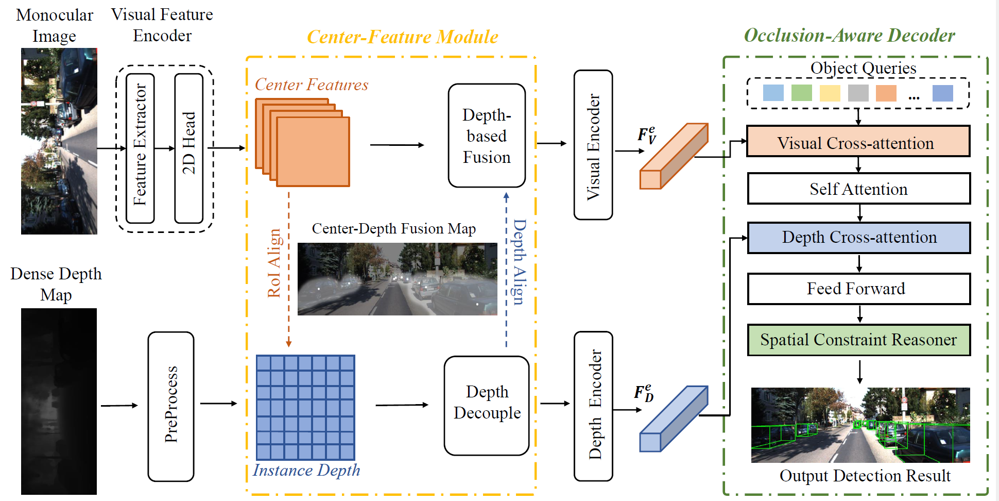

# Occlude3D:Make Occlusion Clear in Monocular 3D Object Detection



## Abstract

Monocular 3D object detection is getting increasingly popular in autonomous driving research owing to its cost and time efficiency. Current methods rely on detecting independent targets, while accuracy declines notably when occlusion occurs, which is a critical and urgent challenge. Relying solely on local features of a single object cannot capture the complete 3D properties of objects in a scene, as it ignores the implicit spatial relationships between different instances. 

To alleviate this problem, we propose a **Center-guided Depth-aware** strategy to capture the positional relationships among instances, called Occlude3D.  Specifically, we design a Center Feature Fusion Module (CFM)  to process the input visual feature and depth feature into learnable queries, and we also propose an Occlusion-Aware Decoder that infers implicit spatial constraints between objects through deep interaction between central visual features and depth features. On the KITTI benchmark, our method significantly increases the state-of-the-art methods by **9.7\%** and **15.2\%** in the moderate and the hard categories. Besides, our method demonstrates significant performance on the Waymo dataset as well.




## Main result
### KITTI Benchmark


### Waymo Benchmark


## Installation

1. create a conda environment:

```bash
conda create -n occlude3d python=3.8 -y
conda activate occlude3d
```

2. Install pytorch and torchvision matching your CUDA version:

```bash
conda install pytorch torchvision cudatoolkit
# We adopt torch 1.10.0+cu111
```

3. Install requirements and compile the deformable attention:

```bash
pip install -r requirements.txt

cd lib/models/occlude3d/ops/
bash make.sh

cd ../../../..
```

4. Download KITTI datasets and prepare the directory structure as:

```
│Occlude3D/
├── data
│   │── KITTI3D
|   │   │── training
|   │   │   ├──calib & label_2 & image_2 & depth_dense
|   │   │── testing
|   │   │   ├──calib & image_2
├──...
```


## Get Started

### Train

You can modify the settings of models and training in `configs/occlude3d.yaml` and indicate the GPU in `train.sh`:

    bash train.sh configs/occlude3d.yaml 

### Test

The best checkpoint will be evaluated as default. You can change it at "./checkpoint" in `configs/occlude3d.yaml`:

```
bash test.sh configs/occlude3d.yaml
```


## Some Qualitative results


